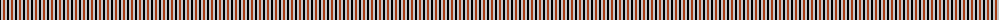
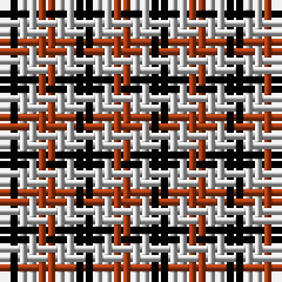

The parent of this is [Coigach Tweed (Estate Check)](/tartans/k/2/n2/t/2/)

This was sourced from tartans-authority.  It is a [3 stripes tartan](/stripes/stripes3/).

Original link http://www.tartansauthority.com/tartan-ferret/display/4553/

## Thread count
K/2 N2 T/2

## Palette
Each colour and its ΔE from the base-6 reference it is a variant of.

| Colour | Shade | Base | ΔE (OKLab) |
|---|---|---|---|
| K |  `#000000` | K  | 0.00 |
| N |  `#C8C8C8` | W  | 0.13 |
| T |  `#A43C14` | R  | 0.08 |

# Sample pattern

ID: /variants/k/2/n2/t/2-k000000-nc8c8c8-ta43c14/
