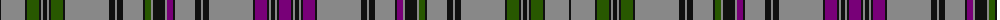

The parent of this is [Weiss-Halliwell (Personal)](/tartans/k/2/n24/k2/g12/k2/n2/k4/n2/k2/g12/k2/n44/k6/n2/k6/n20/k2/g6/n2/k12/n2/p6/k2/n20/k6/n2/k6/n44/k2/p12/k2/n2/k4/n2/k2/p/12/)

This was sourced from tartans-authority.  It is a [36 stripes tartan](/stripes/stripes36/).

Original link http://www.tartansauthority.com/tartan-ferret/display/11055/

## Thread count
K/2 N24 K2 G12 K2 N2 K4 N2 K2 G12 K2 N44 K6 N2 K6 N20 K2 G6 N2 K12 N2 P6 K2 N20 K6 N2 K6 N44 K2 P12 K2 N2 K4 N2 K2 P/12

## Palette
Each colour and its ΔE from the base-6 reference it is a variant of.

| Colour | Shade | Base | ΔE (OKLab) |
|---|---|---|---|
| G |  `#285800` | G  | 0.04 |
| K |  `#101010` | K  | 0.17 |
| N |  `#888888` | R  | 0.24 |
| P |  `#780078` | B  | 0.16 |

ID: /variants/k/2/n24/k2/g12/k2/n2/k4/n2/k2/g12/k2/n44/k6/n2/k6/n20/k2/g6/n2/k12/n2/p6/k2/n20/k6/n2/k6/n44/k2/p12/k2/n2/k4/n2/k2/p/12-g285800-k101010-n888888-p780078/
