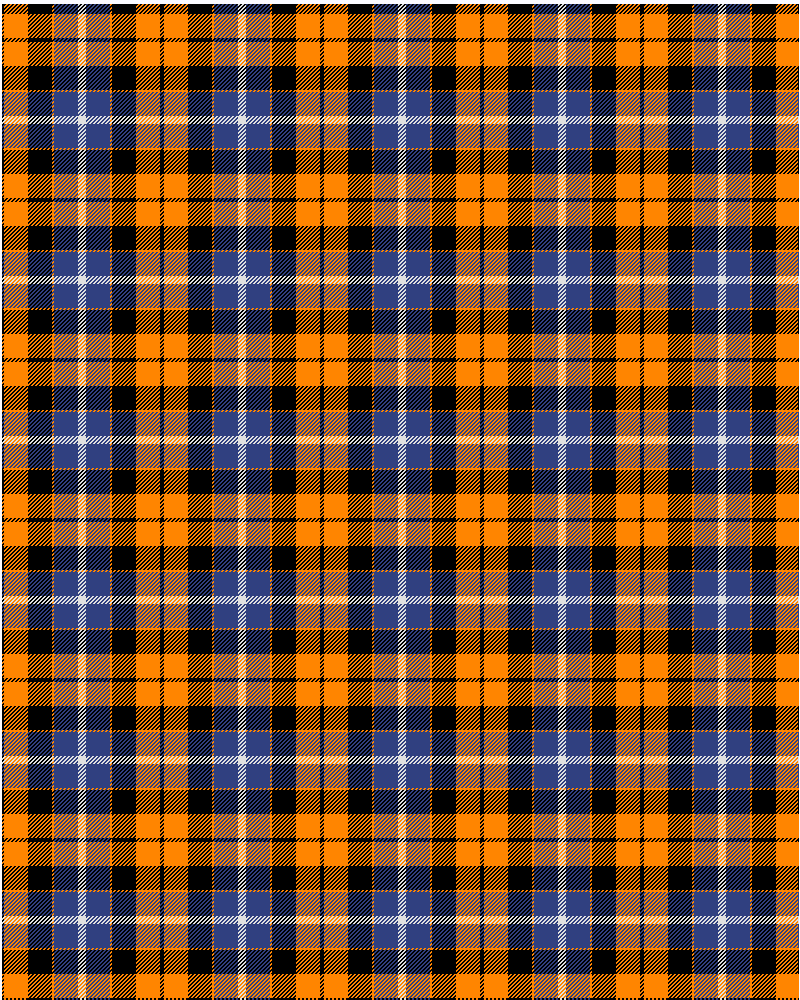

Dutch

This was sourced from <no value>.  It is a 6 stripes tartan.

Original link http://www.weddslist.com/cgi-bin/tartans/pg.pl?source=sts

## Thread count
K/2 O24 K24 O2 B24 LN/4

## Palette
B#304080 K#000000 LN#E0E0E0 O#FF8500

# Sample pattern

ID: /variants/k/2/o24/k24/o2/b24/ln/4-b304080-k000000-lne0e0e0-off8500