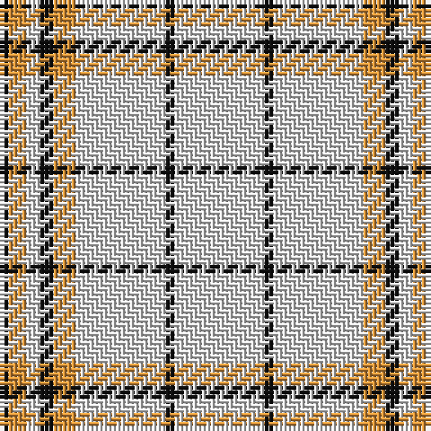

The parent of this is [Guzzo Dress (Personal)](/tartans/k/2/o4/ln3/k3/o5/ln20/k2/ln/20/)

This was sourced from tartans-authority.  It is a [8 stripes tartan](/stripes/stripes8/).

Original link http://www.tartansauthority.com/tartan-ferret/display/10560/

## Thread count
K/2 O4 LN3 K3 O5 LN20 K2 LN/20

## Palette
Each colour and its ΔE from the base-6 reference it is a variant of.

| Colour | Shade | Base | ΔE (OKLab) |
|---|---|---|---|
| K |  `#101010` | K  | 0.17 |
| LN |  `#E0E0E0` | W  | 0.06 |
| O |  `#DC943C` | Y  | 0.12 |

# Sample pattern

ID: /variants/k/2/o4/ln3/k3/o5/ln20/k2/ln/20-k101010-lne0e0e0-odc943c/
