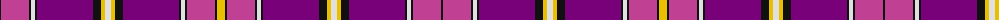

The parent of this is [Svanholm (Personal)](/tartans/k/2/p28/k2/ln4/k2/pa56/k8/y4/ln6/y4/k8/pa56/k2/ln4/k2/p28/k2/y/8/)

This was sourced from register-of-tartans.  It is a [18 stripes tartan](/stripes/stripes18/).

Original link https://www.tartanregister.gov.uk/tartanDetails.aspx?ref=4050

## Thread count
K/2 P28 K2 LN4 K2 Pa56 K8 Y4 LN6 Y4 K8 Pa56 K2 LN4 K2 P28 K2 Y/8

## Palette
Each colour and its ΔE from the base-6 reference it is a variant of.

| Colour | Shade | Base | ΔE (OKLab) |
|---|---|---|---|
| K |  `#101010` | K  | 0.17 |
| LN |  `#E0E0E0` | W  | 0.06 |
| P |  `#C04094` | R  | 0.17 |
| Pa |  `#780078` | B  | 0.16 |
| Y |  `#E8C000` | Y  | 0.00 |

ID: /variants/k/2/p28/k2/ln4/k2/pa56/k8/y4/ln6/y4/k8/pa56/k2/ln4/k2/p28/k2/y/8-k101010-lne0e0e0-pc04094-pa780078-ye8c000/
