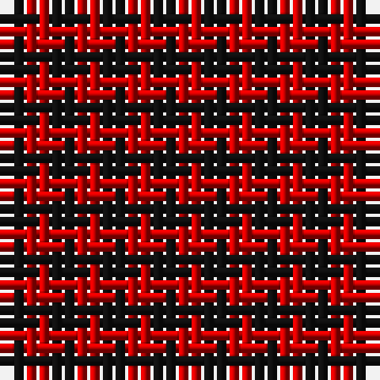

The parent of this is [Rob Roy Macgregor](/tartans/k/2/r/2/)

This was sourced from register-of-tartans.  It is a [2 stripes tartan](/stripes/stripes2/).

Original link https://www.tartanregister.gov.uk/tartanDetails.aspx?ref=3516

## Thread count
K/2 R/2

## Palette
K R

# Sample pattern

ID: /variants/k/2/r/2-k101010-rc80000/
