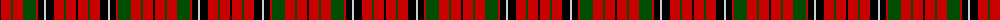

The parent of this is [MacNicol D](/tartans/k/2/r10/g2/r10/g13/r2/k6/n2/k8/r10/g2/r10/k/2/)

This was sourced from weddslist.  It is a [13 stripes tartan](/stripes/stripes13/).

Original link http://www.weddslist.com/cgi-bin/tartans/pg.pl?source=rb

## Thread count
K/2 R10 G2 R10 G13 R2 K6 N2 K8 R10 G2 R10 K/2

## Palette
Each colour and its ΔE from the base-6 reference it is a variant of.

| Colour | Shade | Base | ΔE (OKLab) |
|---|---|---|---|
| G |  `#004C00` | G  | 0.08 |
| K |  `#000000` | K  | 0.00 |
| N |  `#D0D0D0` | W  | 0.11 |
| R |  `#C80000` | R  | 0.00 |

ID: /variants/k/2/r10/g2/r10/g13/r2/k6/n2/k8/r10/g2/r10/k/2-g004c00-k000000-nd0d0d0-rc80000/
