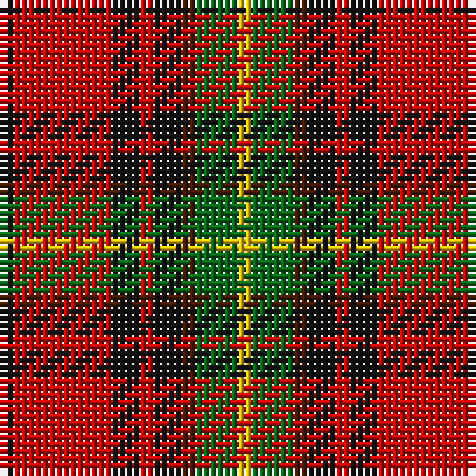

The parent of this is [Craigmoor (Fashion)](/tartans/k/2/r14/k4/r2/k4/dr2/g6/y/2/)

This was sourced from tartans-authority.  It is a [8 stripes tartan](/stripes/stripes8/).

Original link http://www.tartansauthority.com/tartan-ferret/display/8087/

## Thread count
K/2 R14 K4 R2 K4 DR2 G6 Y/2

## Palette
Each colour and its ΔE from the base-6 reference it is a variant of.

| Colour | Shade | Base | ΔE (OKLab) |
|---|---|---|---|
| DR |  `#441800` | B  | 0.22 |
| G |  `#006818` | G  | 0.02 |
| K |  `#101010` | K  | 0.17 |
| R |  `#C80000` | R  | 0.00 |
| Y |  `#E8C000` | Y  | 0.00 |

# Sample pattern

ID: /variants/k/2/r14/k4/r2/k4/dr2/g6/y/2-dr441800-g006818-k101010-rc80000-ye8c000/
