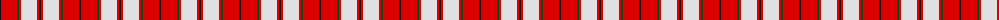
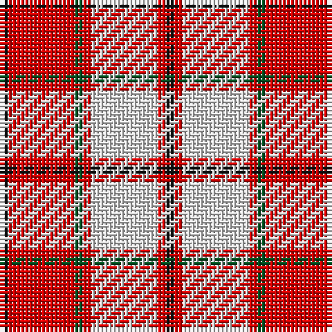

The parent of this is [Cameron Hose](/tartans/k/2/r16/g2/r2/ln16/r2/k/2/)

This was sourced from register-of-tartans.  It is a [7 stripes tartan](/stripes/stripes7/).

Original link https://www.tartanregister.gov.uk/tartanDetails.aspx?ref=492

## Thread count
K/2 R16 G2 R2 LN16 R2 K/2

## Palette
Each colour and its ΔE from the base-6 reference it is a variant of.

| Colour | Shade | Base | ΔE (OKLab) |
|---|---|---|---|
| G |  `#005020` | G  | 0.08 |
| K |  `#101010` | K  | 0.17 |
| LN |  `#E0E0E0` | W  | 0.06 |
| R |  `#DC0000` | R  | 0.04 |

# Sample pattern

ID: /variants/k/2/r16/g2/r2/ln16/r2/k/2-g005020-k101010-lne0e0e0-rdc0000/
