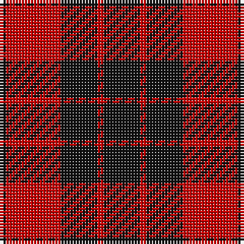

The parent of this is [MacLeod of Raasay Clan Tartan Tartan Number: 1172. Earliest known date: c.1815-20 The thread count given is from the Provost MacBean Collection sample, which is very similar to to the sample in the collection of the Highland Society of London: K2 R18 K12 R2 K16. The design seems likely to be derived from the Vestiarium Scoticum, and would therefore be later than 1829. See products available Copyright © Blair Urquhart, Comrie, 2015](/tartans/k/2/r18/k12/r2/k/12/)

This was sourced from house-of-tartan.  It is a [5 stripes tartan](/stripes/stripes5/).

Original link http://www.house-of-tartan.scotland.net/house/TartanViewjs.asp?colr=Def&tnam=1172

## Thread count
K/2 R18 K12 R2 K/12

## Palette
Each colour and its ΔE from the base-6 reference it is a variant of.

| Colour | Shade | Base | ΔE (OKLab) |
|---|---|---|---|
| K |  `#101010` | K  | 0.17 |
| R |  `#C80000` | R  | 0.00 |

# Sample pattern

ID: /variants/k/2/r18/k12/r2/k/12-k101010-rc80000/
