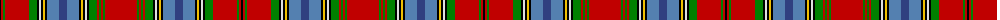

The parent of this is [Macan, of Lurgyvallan](/tartans/k/2/r2/g2/r24/g8/k2/ln2/k2/y2/k2/ba12/b8/ba12/k2/y2/k2/ln2/k2/g8/r2/g2/r2/g2/r/32/)

This was sourced from weddslist.  It is a [24 stripes tartan](/stripes/stripes24/).

Original link http://www.weddslist.com/cgi-bin/tartans/pg.pl?source=sts

## Thread count
K/2 R2 G2 R24 G8 K2 LN2 K2 Y2 K2 Ba12 B8 Ba12 K2 Y2 K2 LN2 K2 G8 R2 G2 R2 G2 R/32

## Palette
Each colour and its ΔE from the base-6 reference it is a variant of.

| Colour | Shade | Base | ΔE (OKLab) |
|---|---|---|---|
| B |  `#304080` | B  | 0.01 |
| Ba |  `#5480B0` | B  | 0.20 |
| G |  `#008000` | G  | 0.09 |
| K |  `#000000` | K  | 0.00 |
| LN |  `#E0E0E0` | W  | 0.06 |
| R |  `#C00000` | R  | 0.02 |
| Y |  `#F0C000` | Y  | 0.01 |

ID: /variants/k/2/r2/g2/r24/g8/k2/ln2/k2/y2/k2/ba12/b8/ba12/k2/y2/k2/ln2/k2/g8/r2/g2/r2/g2/r/32-b304080-ba5480b0-g008000-k000000-lne0e0e0-rc00000-yf0c000/
