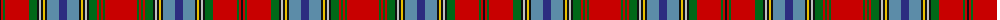

The parent of this is [MacAn of Lurgyvallan (Portrait)](/tartans/k/2/r2/g2/r24/g8/k2/n2/k2/y2/k2/b12/db8/b12/k2/y2/k2/n2/k2/g8/r2/g2/r2/g2/r/32/)

This was sourced from tartans-authority.  It is a [24 stripes tartan](/stripes/stripes24/).

Original link http://www.tartansauthority.com/tartan-ferret/display/1155/

## Thread count
K/2 R2 G2 R24 G8 K2 N2 K2 Y2 K2 B12 DB8 B12 K2 Y2 K2 N2 K2 G8 R2 G2 R2 G2 R/32

## Palette
Each colour and its ΔE from the base-6 reference it is a variant of.

| Colour | Shade | Base | ΔE (OKLab) |
|---|---|---|---|
| B |  `#5C8CA8` | B  | 0.23 |
| DB |  `#2C2C80` | B  | 0.05 |
| G |  `#006818` | G  | 0.02 |
| K |  `#101010` | K  | 0.17 |
| N |  `#C0C0C0` | W  | 0.16 |
| R |  `#C80000` | R  | 0.00 |
| Y |  `#E8C000` | Y  | 0.00 |

ID: /variants/k/2/r2/g2/r24/g8/k2/n2/k2/y2/k2/b12/db8/b12/k2/y2/k2/n2/k2/g8/r2/g2/r2/g2/r/32-b5c8ca8-db2c2c80-g006818-k101010-nc0c0c0-rc80000-ye8c000/
