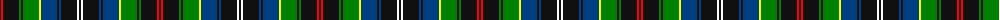

The parent of this is [Survivor](/tartans/k/2/r2/k16/g2/k2/g16/y2/db16/k2/db2/k16/w2/k/2/)

This was sourced from register-of-tartans.  It is a [13 stripes tartan](/stripes/stripes13/).

Original link https://www.tartanregister.gov.uk/tartanDetails.aspx?ref=5853

## Thread count
K/2 R2 K16 G2 K2 G16 Y2 DB16 K2 DB2 K16 W2 K/2

## Palette
Each colour and its ΔE from the base-6 reference it is a variant of.

| Colour | Shade | Base | ΔE (OKLab) |
|---|---|---|---|
| DB |  `#004080` | B  | 0.03 |
| G |  `#008000` | G  | 0.09 |
| K |  `#101010` | K  | 0.17 |
| R |  `#FF0000` | R  | 0.11 |
| W |  `#FFFFFF` | W  | 0.03 |
| Y |  `#FFFF00` | Y  | 0.16 |

ID: /variants/k/2/r2/k16/g2/k2/g16/y2/db16/k2/db2/k16/w2/k/2-db004080-g008000-k101010-rff0000-wffffff-yffff00/
