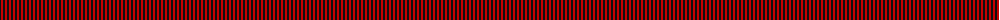

The parent of this is [Welsh Costume (Personal)](/tartans/k/2/r2/k2/r2/k2/r2/k2/r2/k2/r2/k2/r2/k2/r2/k2/r2/k2/r/2/)

This was sourced from register-of-tartans.  It is a [18 stripes tartan](/stripes/stripes18/).

Original link https://www.tartanregister.gov.uk/tartanDetails.aspx?ref=4596

## Thread count
K/2 R2 K2 R2 K2 R2 K2 R2 K2 R2 K2 R2 K2 R2 K2 R2 K2 R/2

## Palette
Each colour and its ΔE from the base-6 reference it is a variant of.

| Colour | Shade | Base | ΔE (OKLab) |
|---|---|---|---|
| K |  `#101010` | K  | 0.17 |
| R |  `#C80000` | R  | 0.00 |

ID: /variants/k/2/r2/k2/r2/k2/r2/k2/r2/k2/r2/k2/r2/k2/r2/k2/r2/k2/r/2-k101010-rc80000/
