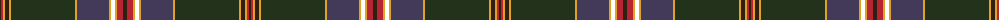

The parent of this is [Neumann, Marcus Name Tartan Tartan Number: 10606. Earliest known date: 24/04/2012 Created primarily for the designer and his immediate family but also for German pipe smokers to share. The broad fields of green and blue represent the Scottish landscape. The red, black and gold reflect the designer's German origins and the main tobaccos blended for pipe smoking (gold for Virginia; black for Latakia; red for Virginia; brown for Burley). Design created online at Scotweb. See products available Copyright © Blair Urquhart, Comrie, 2015](/tartans/k/2/r2/y2/k4/y2/ka64/y2/n32/y2/t4/y2/r6/k/4/)

This was sourced from house-of-tartan.  It is a [13 stripes tartan](/stripes/stripes13/).

Original link http://www.house-of-tartan.scotland.net/house/TartanViewjs.asp?colr=Def&tnam=10606

## Thread count
K/2 R2 Y2 K4 Y2 Ka64 Y2 N32 Y2 T4 Y2 R6 K/4

## Palette
Each colour and its ΔE from the base-6 reference it is a variant of.

| Colour | Shade | Base | ΔE (OKLab) |
|---|---|---|---|
| K |  `#311F11` | B  | 0.20 |
| Ka |  `#23321B` | G  | 0.17 |
| N |  `#433A5A` | B  | 0.08 |
| R |  `#B62531` | R  | 0.04 |
| Y |  `#E0A126` | Y  | 0.08 |

ID: /variants/k/2/r2/y2/k4/y2/ka64/y2/n32/y2/t4/y2/r6/k/4-k311f11-ka23321b-n433a5a-rb62531-ye0a126/
