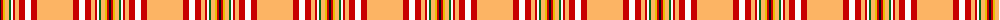

The parent of this is [Studio Wolf Polysun](/tartans/k/2/r2/y2/lg4/g2/w2/r2/lg4/r6/w6/r6/lg/36/)

This was sourced from tartans-authority.  It is a [12 stripes tartan](/stripes/stripes12/).

Original link http://www.tartansauthority.com/tartan-ferret/display/10944/

## Thread count
K/2 R2 Y2 LG4 G2 W2 R2 LG4 R6 W6 R6 LG/36

## Palette
Each colour and its ΔE from the base-6 reference it is a variant of.

| Colour | Shade | Base | ΔE (OKLab) |
|---|---|---|---|
| G |  `#006818` | G  | 0.02 |
| K |  `#101010` | K  | 0.17 |
| LG |  `#FCB464` | Y  | 0.08 |
| R |  `#C80000` | R  | 0.00 |
| W |  `#FCFCFC` | W  | 0.03 |
| Y |  `#E8C000` | Y  | 0.00 |

ID: /variants/k/2/r2/y2/lg4/g2/w2/r2/lg4/r6/w6/r6/lg/36-g006818-k101010-lgfcb464-rc80000-wfcfcfc-ye8c000/
