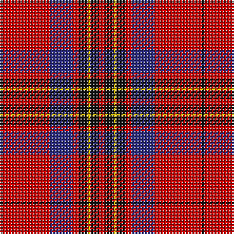

The parent of this is [Leslie Red (VS) (Clan)](/tartans/k/2/r32/db16/r4/k6/y2/k6/r/4/)

This was sourced from tartans-authority.  It is a [8 stripes tartan](/stripes/stripes8/).

Original link http://www.tartansauthority.com/tartan-ferret/display/1142/

## Thread count
K/2 R32 DB16 R4 K6 Y2 K6 R/4

## Palette
Each colour and its ΔE from the base-6 reference it is a variant of.

| Colour | Shade | Base | ΔE (OKLab) |
|---|---|---|---|
| DB |  `#2C2C80` | B  | 0.05 |
| K |  `#101010` | K  | 0.17 |
| R |  `#C80000` | R  | 0.00 |
| Y |  `#E8C000` | Y  | 0.00 |

# Sample pattern

ID: /variants/k/2/r32/db16/r4/k6/y2/k6/r/4-db2c2c80-k101010-rc80000-ye8c000/
