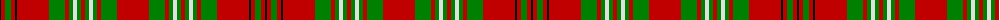

The parent of this is [Scott](/tartans/k/2/r4/g6/r4/k2/r32/g16/r4/g4/ln4/g4/r4/g4/ln4/g4/r4/g16/r/32/)

This was sourced from weddslist.  It is a [18 stripes tartan](/stripes/stripes18/).

Original link http://www.weddslist.com/cgi-bin/tartans/pg.pl?source=sts

## Thread count
K/2 R4 G6 R4 K2 R32 G16 R4 G4 LN4 G4 R4 G4 LN4 G4 R4 G16 R/32

## Palette
Each colour and its ΔE from the base-6 reference it is a variant of.

| Colour | Shade | Base | ΔE (OKLab) |
|---|---|---|---|
| G |  `#008000` | G  | 0.09 |
| K |  `#000000` | K  | 0.00 |
| LN |  `#E0E0E0` | W  | 0.06 |
| R |  `#C00000` | R  | 0.02 |

ID: /variants/k/2/r4/g6/r4/k2/r32/g16/r4/g4/ln4/g4/r4/g4/ln4/g4/r4/g16/r/32-g008000-k000000-lne0e0e0-rc00000/
