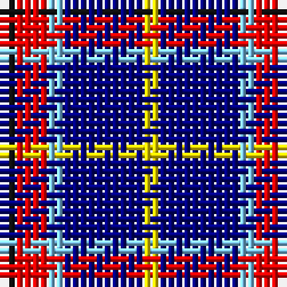

The parent of this is [University of Trinity College](/tartans/k/2/r4/lb2/db10/y/2/)

This was sourced from register-of-tartans.  It is a [5 stripes tartan](/stripes/stripes5/).

Original link https://www.tartanregister.gov.uk/tartanDetails.aspx?ref=10211

## Thread count
K/2 R4 LB2 DB10 Y/2

## Palette
Each colour and its ΔE from the base-6 reference it is a variant of.

| Colour | Shade | Base | ΔE (OKLab) |
|---|---|---|---|
| DB |  `#000080` | B  | 0.14 |
| K |  `#101010` | K  | 0.17 |
| LB |  `#82CFFD` | W  | 0.18 |
| R |  `#FF0000` | R  | 0.11 |
| Y |  `#FFE600` | Y  | 0.10 |

# Sample pattern

ID: /variants/k/2/r4/lb2/db10/y/2-db000080-k101010-lb82cffd-rff0000-yffe600/
