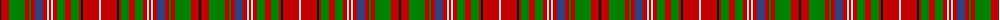

The parent of this is [MacDougal 5](/tartans/k/2/r8/g16/r4/g2/r4/b8/r4/ln2/r2/ln2/r4/g8/r6/g8/r2/k2/r16/ln/2/)

This was sourced from weddslist.  It is a [19 stripes tartan](/stripes/stripes19/).

Original link http://www.weddslist.com/cgi-bin/tartans/pg.pl?source=sts

## Thread count
K/2 R8 G16 R4 G2 R4 B8 R4 LN2 R2 LN2 R4 G8 R6 G8 R2 K2 R16 LN/2

## Palette
Each colour and its ΔE from the base-6 reference it is a variant of.

| Colour | Shade | Base | ΔE (OKLab) |
|---|---|---|---|
| B |  `#304080` | B  | 0.01 |
| G |  `#008000` | G  | 0.09 |
| K |  `#000000` | K  | 0.00 |
| LN |  `#E0E0E0` | W  | 0.06 |
| R |  `#C00000` | R  | 0.02 |

ID: /variants/k/2/r8/g16/r4/g2/r4/b8/r4/ln2/r2/ln2/r4/g8/r6/g8/r2/k2/r16/ln/2-b304080-g008000-k000000-lne0e0e0-rc00000/
