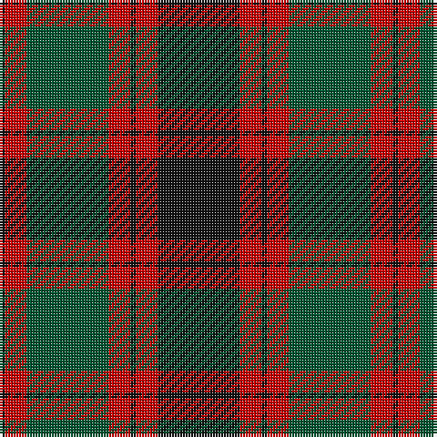

The parent of this is [Logan (Dark)](/tartans/k/2/r8/g30/r8/k2/r8/k/30/)

This was sourced from register-of-tartans.  It is a [7 stripes tartan](/stripes/stripes7/).

Original link https://www.tartanregister.gov.uk/tartanDetails.aspx?ref=4903

## Thread count
K/2 R8 G30 R8 K2 R8 K/30

## Palette
Each colour and its ΔE from the base-6 reference it is a variant of.

| Colour | Shade | Base | ΔE (OKLab) |
|---|---|---|---|
| G |  `#005430` | G  | 0.08 |
| K |  `#101010` | K  | 0.17 |
| R |  `#C80000` | R  | 0.00 |

# Sample pattern

ID: /variants/k/2/r8/g30/r8/k2/r8/k/30-g005430-k101010-rc80000/
