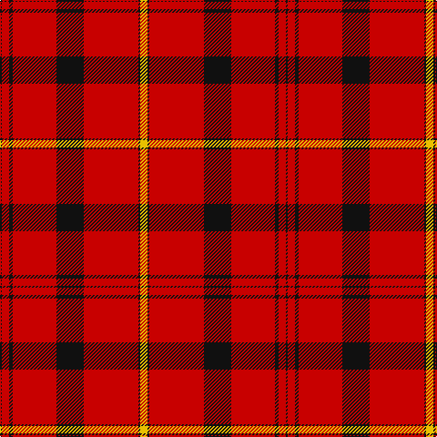

The parent of this is [Oilmens Corporate Tartan Tartan Number: 2044. Earliest known date: pre 1992 Genuinely asymmetrical design by Don Barkwell. No further details. See products available Copyright © Blair Urquhart, Comrie, 2015](/tartans/k/2/r8/k4/r48/k30/r60/k2/y/8/)

This was sourced from house-of-tartan.  It is a [8 stripes tartan](/stripes/stripes8/).

Original link http://www.house-of-tartan.scotland.net/house/TartanViewjs.asp?colr=Def&tnam=2044

## Thread count
K/2 R8 K4 R48 K30 R60 K2 Y/8

## Palette
Each colour and its ΔE from the base-6 reference it is a variant of.

| Colour | Shade | Base | ΔE (OKLab) |
|---|---|---|---|
| K |  `#101010` | K  | 0.17 |
| R |  `#C80000` | R  | 0.00 |
| Y |  `#E8C000` | Y  | 0.00 |

# Sample pattern

ID: /variants/k/2/r8/k4/r48/k30/r60/k2/y/8-k101010-rc80000-ye8c000/
