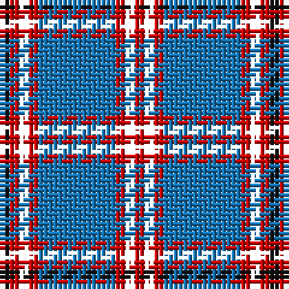

The parent of this is [Laing of Archiestown Clan/Family Tartan Tartan Number: 2544. Earliest known date: 1783 Said to have been woven in 1783 in Knockando Morayshire, by William Donald Laing of Queensland, Australia who donated a sample to the Tartans Society in 1996. The dark line in the centre of the red band is either blue or black. Apparently William Laing acquired the piece of tartan in 1961 from a Mr Jack Garden whose g.g. grandfather was John Laing (dob 1767) who wove the tartan. In the 1810 census he lived in his shop in the Square at Archiestown. See products available Copyright © Blair Urquhart, Comrie, 2015](/tartans/k/2/ra2/cw2/ra2/b16/ra2/cw2/ra/2/)

This was sourced from house-of-tartan.  It is a [8 stripes tartan](/stripes/stripes8/).

Original link http://www.house-of-tartan.scotland.net/house/TartanViewjs.asp?colr=Def&tnam=2544

## Thread count
K/2 Ra2 CW2 Ra2 B16 Ra2 CW2 Ra/2

## Palette
Each colour and its ΔE from the base-6 reference it is a variant of.

| Colour | Shade | Base | ΔE (OKLab) |
|---|---|---|---|
| B |  `#1474B4` | B  | 0.15 |
| DG |  `#003820` | G  | 0.16 |
| DY |  `#D09000` | Y  | 0.13 |
| K |  `#101010` | K  | 0.17 |
| R |  `#B03000` | R  | 0.05 |
| Ra |  `#C80000` | R  | 0.00 |
| Y |  `#E8C000` | Y  | 0.00 |

# Sample pattern

ID: /variants/k/2/ra2/cw2/ra2/b16/ra2/cw2/ra/2-b1474b4-dg003820-dyd09000-k101010-rb03000-rac80000-ye8c000/
