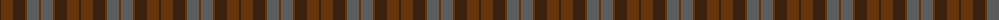
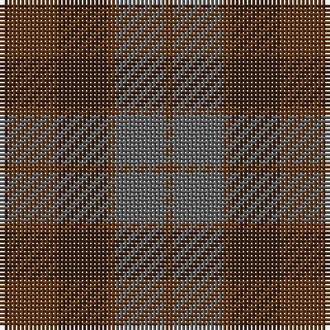

The parent of this is [Brown Heather (Fashion)](/tartans/k/2/t12/k12/t2/n12/t/2/)

This was sourced from tartans-authority.  It is a [6 stripes tartan](/stripes/stripes6/).

Original link http://www.tartansauthority.com/tartan-ferret/display/3737/

## Thread count
K/2 T12 K12 T2 N12 T/2

## Palette
Each colour and its ΔE from the base-6 reference it is a variant of.

| Colour | Shade | Base | ΔE (OKLab) |
|---|---|---|---|
| K |  `#3C2010` | B  | 0.20 |
| N |  `#5C5C5C` | B  | 0.14 |
| T |  `#64340C` | G  | 0.18 |

# Sample pattern

ID: /variants/k/2/t12/k12/t2/n12/t/2-k3c2010-n5c5c5c-t64340c/
