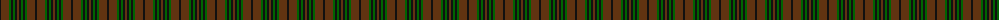
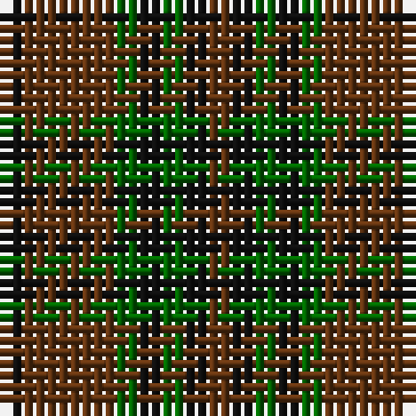

The parent of this is [McCanna NW (Olympia, USA) Hunting (Personal)](/tartans/k/2/t8/g2/k2/g2/k2/t/2/)

This was sourced from register-of-tartans.  It is a [7 stripes tartan](/stripes/stripes7/).

Original link https://www.tartanregister.gov.uk/tartanDetails.aspx?ref=10274

## Thread count
K/2 T8 G2 K2 G2 K2 T/2

## Palette
Each colour and its ΔE from the base-6 reference it is a variant of.

| Colour | Shade | Base | ΔE (OKLab) |
|---|---|---|---|
| G |  `#006400` | G  | 0.00 |
| K |  `#101010` | K  | 0.17 |
| T |  `#603311` | G  | 0.18 |

# Sample pattern

ID: /variants/k/2/t8/g2/k2/g2/k2/t/2-g006400-k101010-t603311/
