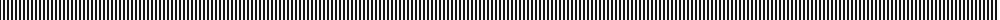

The parent of this is [Northumberland (District)](/tartans/k/2/w/2/)

This was sourced from tartans-authority.  It is a [2 stripes tartan](/stripes/stripes2/).

Original link http://www.tartansauthority.com/tartan-ferret/display/6765/

## Thread count
K/2 W/2

## Palette
Each colour and its ΔE from the base-6 reference it is a variant of.

| Colour | Shade | Base | ΔE (OKLab) |
|---|---|---|---|
| K |  `#101010` | K  | 0.17 |
| W |  `#F8F8F8` | W  | 0.01 |

# Sample pattern

ID: /variants/k/2/w/2-k101010-wf8f8f8/
