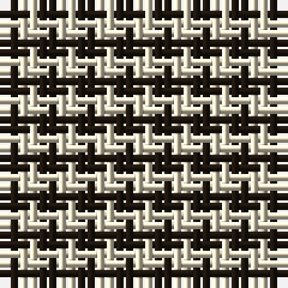

The parent of this is [Falkirk Tartan](/tartans/k/2/w/2/)

This was sourced from research.  It is a [2 stripes tartan](/stripes/stripes2/).

Original link https://www.nms.ac.uk/

## Thread count
K/2 W/2

## Palette
K W

# Sample pattern

ID: /variants/k/2/w/2-k1e160e-we8dcc0/
