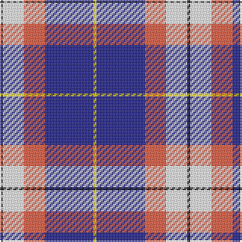

The parent of this is [Prehospital EMS Tartan (USA)](/tartans/k/2/w14/o14/db32/y/2/)

This was sourced from register-of-tartans.  It is a [5 stripes tartan](/stripes/stripes5/).

Original link https://www.tartanregister.gov.uk/tartanDetails.aspx?ref=10182

## Thread count
K/2 W14 O14 DB32 Y/2

## Palette
Each colour and its ΔE from the base-6 reference it is a variant of.

| Colour | Shade | Base | ΔE (OKLab) |
|---|---|---|---|
| DB |  `#23238E` | B  | 0.07 |
| K |  `#101010` | K  | 0.17 |
| O |  `#EE5C42` | R  | 0.14 |
| W |  `#FFFFFF` | W  | 0.03 |
| Y |  `#EEC900` | Y  | 0.03 |

# Sample pattern

ID: /variants/k/2/w14/o14/db32/y/2-db23238e-k101010-oee5c42-wffffff-yeec900/
