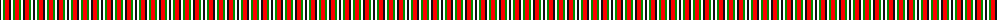
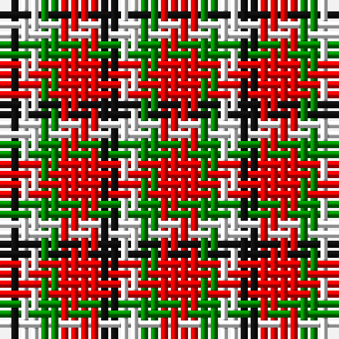

The parent of this is [Harazeen](/tartans/k/2/w2/g2/r4/k2/w2/g2/r/4/)

This was sourced from register-of-tartans.  It is a [8 stripes tartan](/stripes/stripes8/).

Original link https://www.tartanregister.gov.uk/tartanDetails.aspx?ref=10249

## Thread count
K/2 W2 G2 R4 K2 W2 G2 R/4

## Palette
Each colour and its ΔE from the base-6 reference it is a variant of.

| Colour | Shade | Base | ΔE (OKLab) |
|---|---|---|---|
| G |  `#008B00` | G  | 0.12 |
| K |  `#101010` | K  | 0.17 |
| R |  `#FF0000` | R  | 0.11 |
| W |  `#FFFFFF` | W  | 0.03 |

# Sample pattern

ID: /variants/k/2/w2/g2/r4/k2/w2/g2/r/4-g008b00-k101010-rff0000-wffffff/
