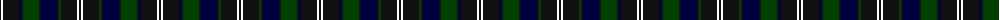

The parent of this is [Chess](/tartans/k/2/w2/k16/db2/k2/g16/k2/db16/k2/g2/k16/w2/k/2/)

This was sourced from register-of-tartans.  It is a [13 stripes tartan](/stripes/stripes13/).

Original link https://www.tartanregister.gov.uk/tartanDetails.aspx?ref=5934

## Thread count
K/2 W2 K16 DB2 K2 G16 K2 DB16 K2 G2 K16 W2 K/2

## Palette
Each colour and its ΔE from the base-6 reference it is a variant of.

| Colour | Shade | Base | ΔE (OKLab) |
|---|---|---|---|
| DB |  `#000040` | K  | 0.20 |
| G |  `#004000` | G  | 0.12 |
| K |  `#101010` | K  | 0.17 |
| W |  `#FFFFFF` | W  | 0.03 |

ID: /variants/k/2/w2/k16/db2/k2/g16/k2/db16/k2/g2/k16/w2/k/2-db000040-g004000-k101010-wffffff/
