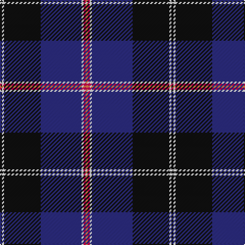

The parent of this is [Fuller of Hopewell (Personal)](/tartans/k/2/w2/k36/db40/w2/r2/o/2/)

This was sourced from tartans-authority.  It is a [7 stripes tartan](/stripes/stripes7/).

Original link http://www.tartansauthority.com/tartan-ferret/display/6781/

## Thread count
K/2 W2 K36 DB40 W2 R2 O/2

## Palette
Each colour and its ΔE from the base-6 reference it is a variant of.

| Colour | Shade | Base | ΔE (OKLab) |
|---|---|---|---|
| DB |  `#2C2C80` | B  | 0.05 |
| K |  `#101010` | K  | 0.17 |
| O |  `#EC8048` | Y  | 0.17 |
| R |  `#C80050` | R  | 0.07 |
| W |  `#F8F8F8` | W  | 0.01 |

# Sample pattern

ID: /variants/k/2/w2/k36/db40/w2/r2/o/2-db2c2c80-k101010-oec8048-rc80050-wf8f8f8/
