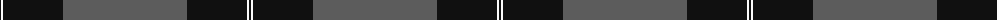
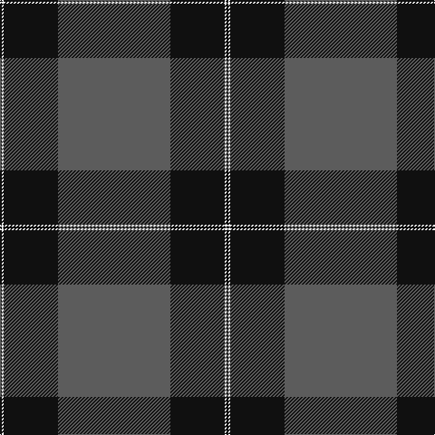

The parent of this is [Pride of New Zealand (District?)](/tartans/k/2/w2/k60/n/124/)

This was sourced from tartans-authority.  It is a [4 stripes tartan](/stripes/stripes4/).

Original link http://www.tartansauthority.com/tartan-ferret/display/2632/

## Thread count
K/2 W2 K60 N/124

## Palette
Each colour and its ΔE from the base-6 reference it is a variant of.

| Colour | Shade | Base | ΔE (OKLab) |
|---|---|---|---|
| K |  `#101010` | K  | 0.17 |
| N |  `#5C5C5C` | B  | 0.14 |
| W |  `#FCFCFC` | W  | 0.03 |

# Sample pattern

ID: /variants/k/2/w2/k60/n/124-k101010-n5c5c5c-wfcfcfc/
