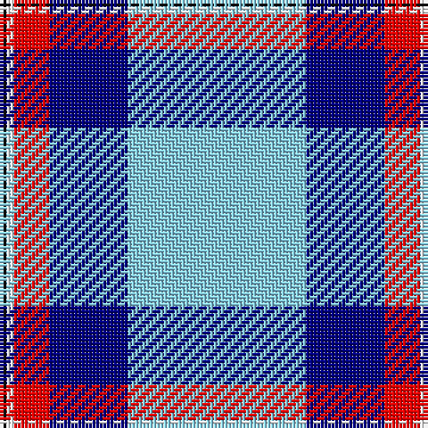

The parent of this is [Mount Vernon Primary School](/tartans/k/2/w2/r10/db22/lb/50/)

This was sourced from register-of-tartans.  It is a [5 stripes tartan](/stripes/stripes5/).

Original link https://www.tartanregister.gov.uk/tartanDetails.aspx?ref=10420

## Thread count
K/2 W2 R10 DB22 LB/50

## Palette
Each colour and its ΔE from the base-6 reference it is a variant of.

| Colour | Shade | Base | ΔE (OKLab) |
|---|---|---|---|
| DB |  `#000080` | B  | 0.14 |
| K |  `#101010` | K  | 0.17 |
| LB |  `#87CEEB` | W  | 0.17 |
| R |  `#FF0000` | R  | 0.11 |
| W |  `#FFFFFF` | W  | 0.03 |

# Sample pattern

ID: /variants/k/2/w2/r10/db22/lb/50-db000080-k101010-lb87ceeb-rff0000-wffffff/
