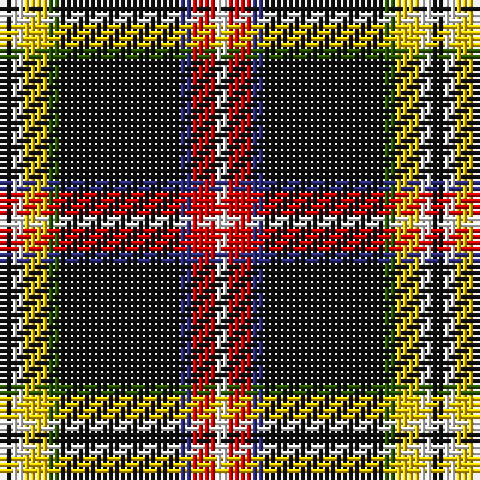

The parent of this is [Kaptain Family (Personal)](/tartans/k/2/w2/y4/g2/k20/db2/r4/w/2/)

This was sourced from register-of-tartans.  It is a [8 stripes tartan](/stripes/stripes8/).

Original link https://www.tartanregister.gov.uk/tartanDetails.aspx?ref=11313

## Thread count
K/2 W2 Y4 G2 K20 DB2 R4 W/2

## Palette
Each colour and its ΔE from the base-6 reference it is a variant of.

| Colour | Shade | Base | ΔE (OKLab) |
|---|---|---|---|
| DB |  `#2C2C80` | B  | 0.05 |
| G |  `#285800` | G  | 0.04 |
| K |  `#101010` | K  | 0.17 |
| R |  `#DC0000` | R  | 0.04 |
| W |  `#F8F8F8` | W  | 0.01 |
| Y |  `#FCCC00` | Y  | 0.04 |

# Sample pattern

ID: /variants/k/2/w2/y4/g2/k20/db2/r4/w/2-db2c2c80-g285800-k101010-rdc0000-wf8f8f8-yfccc00/
