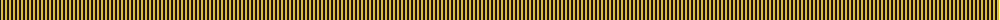
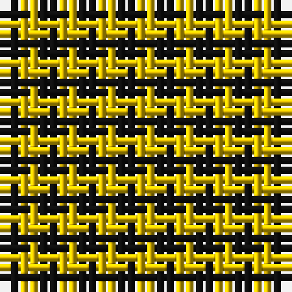

The parent of this is [Justus Check (Personal)](/tartans/k/2/y/2/)

This was sourced from register-of-tartans.  It is a [2 stripes tartan](/stripes/stripes2/).

Original link https://www.tartanregister.gov.uk/tartanDetails.aspx?ref=1919

## Thread count
K/2 Y/2

## Palette
K Y

# Sample pattern

ID: /variants/k/2/y/2-k101010-ye8c000/
