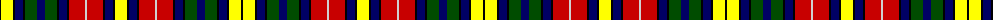

The parent of this is [Buchanan](/tartans/k/2/y12/k2/db8/k2/g12/db8/g12/k2/db8/k2/r16/n2/r16/k2/db8/k2/y/12/)

This was sourced from weddslist.  It is a [18 stripes tartan](/stripes/stripes18/).

Original link http://www.weddslist.com/cgi-bin/tartans/pg.pl?source=rb

## Thread count
K/2 Y12 K2 DB8 K2 G12 DB8 G12 K2 DB8 K2 R16 N2 R16 K2 DB8 K2 Y/12

## Palette
Each colour and its ΔE from the base-6 reference it is a variant of.

| Colour | Shade | Base | ΔE (OKLab) |
|---|---|---|---|
| DB |  `#000064` | B  | 0.17 |
| G |  `#004C00` | G  | 0.08 |
| K |  `#000000` | K  | 0.00 |
| N |  `#D0D0D0` | W  | 0.11 |
| R |  `#C80000` | R  | 0.00 |
| Y |  `#FFFF00` | Y  | 0.16 |

ID: /variants/k/2/y12/k2/db8/k2/g12/db8/g12/k2/db8/k2/r16/n2/r16/k2/db8/k2/y/12-db000064-g004c00-k000000-nd0d0d0-rc80000-yffff00/
