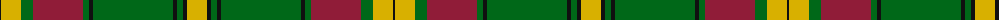

The parent of this is [MacMillan Anc (Clans Originaux)](/tartans/k/2/y20/g12/dr50/g6/k4/g80/k4/g6/k4/y/20/)

This was sourced from register-of-tartans.  It is a [11 stripes tartan](/stripes/stripes11/).

Original link https://www.tartanregister.gov.uk/tartanDetails.aspx?ref=2656

## Thread count
K/2 Y20 G12 DR50 G6 K4 G80 K4 G6 K4 Y/20

## Palette
Each colour and its ΔE from the base-6 reference it is a variant of.

| Colour | Shade | Base | ΔE (OKLab) |
|---|---|---|---|
| DR |  `#901C38` | R  | 0.12 |
| G |  `#006818` | G  | 0.02 |
| K |  `#101010` | K  | 0.17 |
| Y |  `#D8B000` | Y  | 0.05 |
| Ya |  `#E8C000` | Y  | 0.00 |

ID: /variants/k/2/y20/g12/dr50/g6/k4/g80/k4/g6/k4/y/20-dr901c38-g006818-k101010-yd8b000-yae8c000/
