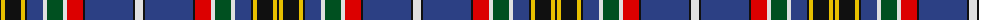

The parent of this is [South Africa](/tartans/k/2/y4/k16/y4/k2/b16/ln4/g16/ln4/r16/k2/b48/k2/ln/8/)

This was sourced from register-of-tartans.  It is a [14 stripes tartan](/stripes/stripes14/).

Original link https://www.tartanregister.gov.uk/tartanDetails.aspx?ref=5857

## Thread count
K/2 Y4 K16 Y4 K2 B16 LN4 G16 LN4 R16 K2 B48 K2 LN/8

## Palette
Each colour and its ΔE from the base-6 reference it is a variant of.

| Colour | Shade | Base | ΔE (OKLab) |
|---|---|---|---|
| B |  `#2C4084` | B  | 0.00 |
| G |  `#005020` | G  | 0.08 |
| K |  `#101010` | K  | 0.17 |
| LN |  `#E0E0E0` | W  | 0.06 |
| R |  `#DC0000` | R  | 0.04 |
| Y |  `#E8C000` | Y  | 0.00 |

ID: /variants/k/2/y4/k16/y4/k2/b16/ln4/g16/ln4/r16/k2/b48/k2/ln/8-b2c4084-g005020-k101010-lne0e0e0-rdc0000-ye8c000/
