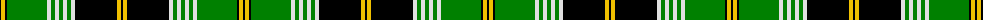

The parent of this is [Hammaby,The](/tartans/k/2/y4/k2/g40/ln4/g4/ln4/g4/ln4/g4/ln4/k42/y4/k/2/)

This was sourced from weddslist.  It is a [14 stripes tartan](/stripes/stripes14/).

Original link http://www.weddslist.com/cgi-bin/tartans/pg.pl?source=sts

## Thread count
K/2 Y4 K2 G40 LN4 G4 LN4 G4 LN4 G4 LN4 K42 Y4 K/2

## Palette
Each colour and its ΔE from the base-6 reference it is a variant of.

| Colour | Shade | Base | ΔE (OKLab) |
|---|---|---|---|
| G |  `#008000` | G  | 0.09 |
| K |  `#000000` | K  | 0.00 |
| LN |  `#E0E0E0` | W  | 0.06 |
| Y |  `#F0C000` | Y  | 0.01 |

ID: /variants/k/2/y4/k2/g40/ln4/g4/ln4/g4/ln4/g4/ln4/k42/y4/k/2-g008000-k000000-lne0e0e0-yf0c000/
