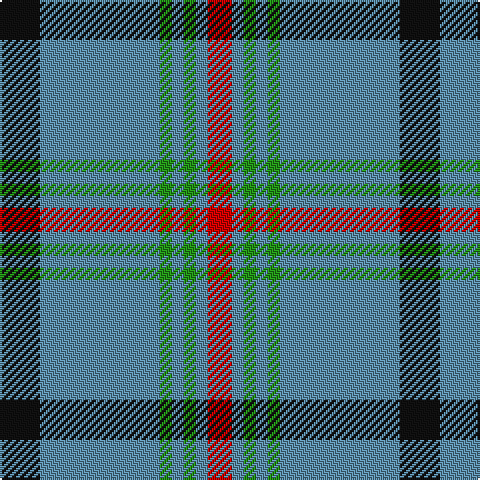

The parent of this is [Kinding (Personal)](/tartans/k/20/b60/g6/b6/g6/b6/r/12/)

This was sourced from tartans-authority.  It is a [7 stripes tartan](/stripes/stripes7/).

Original link http://www.tartansauthority.com/tartan-ferret/display/10091/

## Thread count
K/20 B60 G6 B6 G6 B6 R/12

## Palette
Each colour and its ΔE from the base-6 reference it is a variant of.

| Colour | Shade | Base | ΔE (OKLab) |
|---|---|---|---|
| B |  `#5C8CA8` | B  | 0.23 |
| G |  `#249018` | G  | 0.14 |
| K |  `#101010` | K  | 0.17 |
| R |  `#C80000` | R  | 0.00 |

# Sample pattern

ID: /variants/k/20/b60/g6/b6/g6/b6/r/12-b5c8ca8-g249018-k101010-rc80000/
