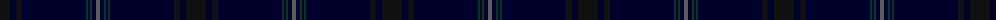

The parent of this is [Orman (Personal)](/tartans/k/20/db6/k6/db64/dg2/db2/dg2/db4/n/4/)

This was sourced from tartans-authority.  It is a [9 stripes tartan](/stripes/stripes9/).

Original link http://www.tartansauthority.com/tartan-ferret/display/10744/

## Thread count
K/20 DB6 K6 DB64 DG2 DB2 DG2 DB4 N/4

## Palette
Each colour and its ΔE from the base-6 reference it is a variant of.

| Colour | Shade | Base | ΔE (OKLab) |
|---|---|---|---|
| DB |  `#00002C` | K  | 0.16 |
| DG |  `#003820` | G  | 0.16 |
| K |  `#101010` | K  | 0.17 |
| N |  `#5C5C5C` | B  | 0.14 |

ID: /variants/k/20/db6/k6/db64/dg2/db2/dg2/db4/n/4-db00002c-dg003820-k101010-n5c5c5c/
