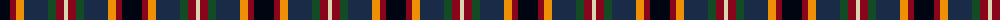
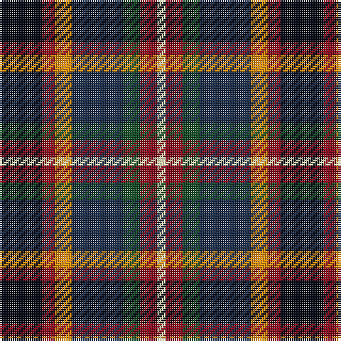

The parent of this is [Eichelberger Family, Jörg (Personal)](/tartans/k/20/dr6/o8/dn24/g8/dr8/lr/4/)

This was sourced from register-of-tartans.  It is a [7 stripes tartan](/stripes/stripes7/).

Original link https://www.tartanregister.gov.uk/tartanDetails.aspx?ref=10584

## Thread count
K/20 DR6 O8 DN24 G8 DR8 LR/4

## Palette
Each colour and its ΔE from the base-6 reference it is a variant of.

| Colour | Shade | Base | ΔE (OKLab) |
|---|---|---|---|
| DN |  `#1A2B47` | B  | 0.12 |
| DR |  `#89051B` | R  | 0.14 |
| G |  `#124B24` | G  | 0.09 |
| K |  `#010512` | K  | 0.12 |
| LR |  `#DDD5AF` | W  | 0.11 |
| O |  `#EF8F06` | Y  | 0.12 |

# Sample pattern

ID: /variants/k/20/dr6/o8/dn24/g8/dr8/lr/4-dn1a2b47-dr89051b-g124b24-k010512-lrddd5af-oef8f06/
