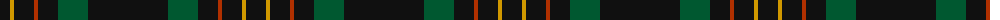

The parent of this is [Langhein, Alex (Personal)](/tartans/k/20/dy4/k20/r4/k20/g30/k/80/)

This was sourced from tartans-authority.  It is a [7 stripes tartan](/stripes/stripes7/).

Original link http://www.tartansauthority.com/tartan-ferret/display/3235/

## Thread count
K/20 DY4 K20 R4 K20 G30 K/80

## Palette
Each colour and its ΔE from the base-6 reference it is a variant of.

| Colour | Shade | Base | ΔE (OKLab) |
|---|---|---|---|
| DY |  `#D09800` | Y  | 0.11 |
| G |  `#005830` | G  | 0.06 |
| K |  `#101010` | K  | 0.17 |
| R |  `#B03000` | R  | 0.05 |

# Sample pattern

ID: /variants/k/20/dy4/k20/r4/k20/g30/k/80-dyd09800-g005830-k101010-rb03000/
