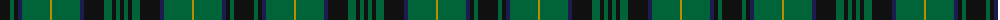

The parent of this is [Sawicki, Peter (Personal)](/tartans/k/20/g4/k4/db4/g28/dy2/g28/db4/k20/g8/k4/g4/k/4/)

This was sourced from tartans-authority.  It is a [13 stripes tartan](/stripes/stripes13/).

Original link http://www.tartansauthority.com/tartan-ferret/display/10223/

## Thread count
K/20 G4 K4 DB4 G28 DY2 G28 DB4 K20 G8 K4 G4 K/4

## Palette
Each colour and its ΔE from the base-6 reference it is a variant of.

| Colour | Shade | Base | ΔE (OKLab) |
|---|---|---|---|
| DB |  `#1C1C50` | B  | 0.14 |
| DY |  `#BC8C00` | Y  | 0.16 |
| G |  `#006438` | G  | 0.05 |
| K |  `#101010` | K  | 0.17 |

ID: /variants/k/20/g4/k4/db4/g28/dy2/g28/db4/k20/g8/k4/g4/k/4-db1c1c50-dybc8c00-g006438-k101010/
