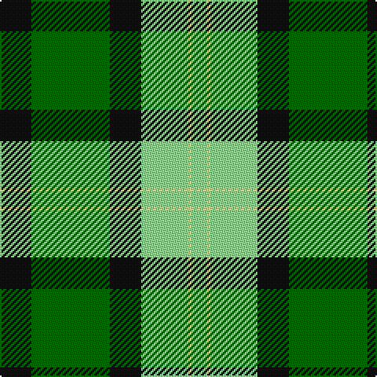

The parent of this is [Delaware Fine Spirits Guild](/tartans/k/20/g50/k20/lg30/ly2/lg/10/)

This was sourced from register-of-tartans.  It is a [6 stripes tartan](/stripes/stripes6/).

Original link https://www.tartanregister.gov.uk/tartanDetails.aspx?ref=10204

## Thread count
K/20 G50 K20 LG30 LY2 LG/10

## Palette
Each colour and its ΔE from the base-6 reference it is a variant of.

| Colour | Shade | Base | ΔE (OKLab) |
|---|---|---|---|
| G |  `#006400` | G  | 0.00 |
| K |  `#101010` | K  | 0.17 |
| LG |  `#90EE90` | Y  | 0.15 |
| LY |  `#FFF68F` | W  | 0.12 |

# Sample pattern

ID: /variants/k/20/g50/k20/lg30/ly2/lg/10-g006400-k101010-lg90ee90-lyfff68f/
