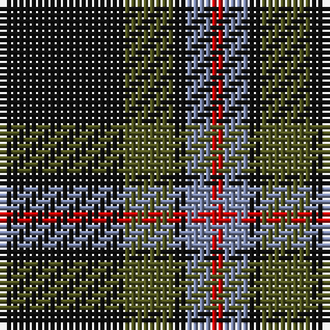

The parent of this is [Brotherhood of the Kilt](/tartans/k/20/g8/k2/b4/r/2/)

This was sourced from register-of-tartans.  It is a [5 stripes tartan](/stripes/stripes5/).

Original link https://www.tartanregister.gov.uk/tartanDetails.aspx?ref=5659

## Thread count
K/20 G8 K2 B4 R/2

## Palette
Each colour and its ΔE from the base-6 reference it is a variant of.

| Colour | Shade | Base | ΔE (OKLab) |
|---|---|---|---|
| B |  `#7884A8` | B  | 0.23 |
| G |  `#505420` | G  | 0.09 |
| K |  `#101010` | K  | 0.17 |
| R |  `#C80000` | R  | 0.00 |

# Sample pattern

ID: /variants/k/20/g8/k2/b4/r/2-b7884a8-g505420-k101010-rc80000/
