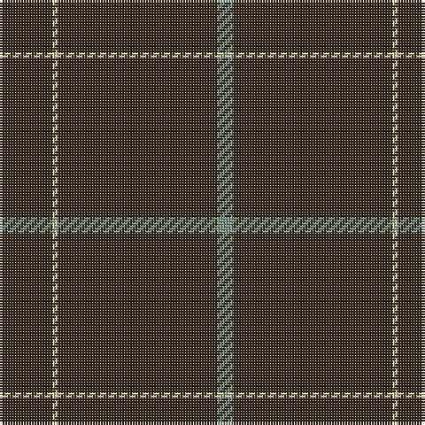

The parent of this is [Pasteur Fancy Tartan Tartan Number: 7094. Earliest known date: 1836 The pattern is taken from a shawl or cloak which appears in a portrait of Louie Pasteur's mother. The portrait was drawn in pastels when Pasteur was just 13 years old. The information came Marie-Claude Fortier researching the life of Pasteur. See products available Copyright © Blair Urquhart, Comrie, 2015](/tartans/k/20/lr2/k60/lg/6/)

This was sourced from house-of-tartan.  It is a [4 stripes tartan](/stripes/stripes4/).

Original link http://www.house-of-tartan.scotland.net/house/TartanViewjs.asp?colr=Def&tnam=7094

## Thread count
K/20 LR2 K60 LG/6

## Palette
Each colour and its ΔE from the base-6 reference it is a variant of.

| Colour | Shade | Base | ΔE (OKLab) |
|---|---|---|---|
| K |  `#34281C` | B  | 0.18 |
| LG |  `#789484` | G  | 0.23 |
| LR |  `#E4CCA4` | Y  | 0.12 |

# Sample pattern

ID: /variants/k/20/lr2/k60/lg/6-k34281c-lg789484-lre4cca4/
