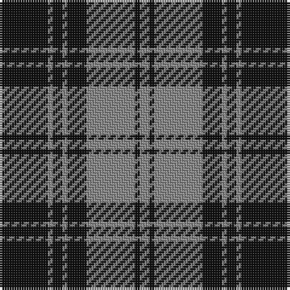

The parent of this is [Douglas, Grey (Clan)](/tartans/k/20/n2/k4/n2/k8/n20/k2/n/4/)

This was sourced from tartans-authority.  It is a [8 stripes tartan](/stripes/stripes8/).

Original link http://www.tartansauthority.com/tartan-ferret/display/1127/

## Thread count
K/20 N2 K4 N2 K8 N20 K2 N/4

## Palette
Each colour and its ΔE from the base-6 reference it is a variant of.

| Colour | Shade | Base | ΔE (OKLab) |
|---|---|---|---|
| K |  `#101010` | K  | 0.17 |
| N |  `#888888` | R  | 0.24 |

# Sample pattern

ID: /variants/k/20/n2/k4/n2/k8/n20/k2/n/4-k101010-n888888/
