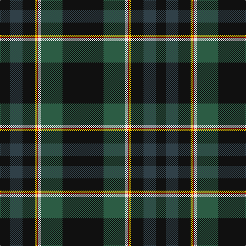

The parent of this is [MacNeill, Royce (Personal)](/tartans/k/20/n24/k24/y4/r2/ln6/na42/k/80/)

This was sourced from register-of-tartans.  It is a [8 stripes tartan](/stripes/stripes8/).

Original link https://www.tartanregister.gov.uk/tartanDetails.aspx?ref=5538

## Thread count
K/20 N24 K24 Y4 R2 LN6 Na42 K/80

## Palette
Each colour and its ΔE from the base-6 reference it is a variant of.

| Colour | Shade | Base | ΔE (OKLab) |
|---|---|---|---|
| K |  `#101010` | K  | 0.17 |
| LN |  `#E0E0E0` | W  | 0.06 |
| N |  `#304048` | B  | 0.10 |
| Na |  `#2C5C44` | G  | 0.09 |
| R |  `#C80000` | R  | 0.00 |
| Y |  `#E8C000` | Y  | 0.00 |

# Sample pattern

ID: /variants/k/20/n24/k24/y4/r2/ln6/na42/k/80-k101010-lne0e0e0-n304048-na2c5c44-rc80000-ye8c000/
