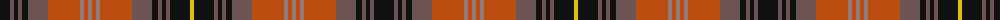

The parent of this is [Dryburgh Clan Tartan Tartan Number: 6422. Earliest known date: 2004 Based on Kerr, and the colours of the Dryburgh coat of arms including the 3 martlet birds, matriculated for William J. Dryburgh. See products available Copyright © Blair Urquhart, Comrie, 2015](/tartans/k/20/na4/k4/na4/k6/na20/do32/n4/do4/n4/do4/n4/do32/na20/k6/na4/k4/na4/k20/y/4/)

This was sourced from house-of-tartan.  It is a [20 stripes tartan](/stripes/stripes20/).

Original link http://www.house-of-tartan.scotland.net/house/TartanViewjs.asp?colr=Def&tnam=6422

## Thread count
K/20 Na4 K4 Na4 K6 Na20 DO32 N4 DO4 N4 DO4 N4 DO32 Na20 K6 Na4 K4 Na4 K20 Y/4

## Palette
Each colour and its ΔE from the base-6 reference it is a variant of.

| Colour | Shade | Base | ΔE (OKLab) |
|---|---|---|---|
| DB |  `#2C2C80` | B  | 0.05 |
| DO |  `#BC4C10` | R  | 0.08 |
| G |  `#006818` | G  | 0.02 |
| K |  `#101010` | K  | 0.17 |
| N |  `#907C80` | R  | 0.21 |
| Na |  `#6C5454` | B  | 0.15 |
| Y |  `#DCC010` | Y  | 0.02 |

ID: /variants/k/20/na4/k4/na4/k6/na20/do32/n4/do4/n4/do4/n4/do32/na20/k6/na4/k4/na4/k20/y/4-db2c2c80-dobc4c10-g006818-k101010-n907c80-na6c5454-ydcc010/
